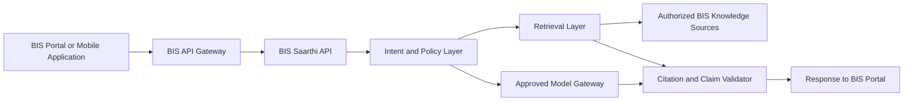

# BIS Saarthi Integration Readiness

## 1. Purpose

This document describes a proposed path to integrate BIS Saarthi into the existing BIS portal without requiring BIS to replace its current frontend or backend technology. It does not assume or claim knowledge of BIS's private or internal technology stack.

## 2. Core integration principle

- The assistant is technology-independent at its integration boundary.
- BIS Saarthi communicates through typed HTTPS REST APIs.
- A Java, .NET, PHP, Node.js, Python, or other portal can consume the same API.
- Compatibility comes from API contracts, authentication, data formats, networking, security, and deployment standards—not identical frameworks.

## 3. Current prototype architecture

**Currently implemented (prototype only):**

- React, TypeScript, and Vite frontend; FastAPI and Pydantic backend.
- ChromaDB retrieval store using `intfloat/multilingual-e5-small` embeddings.
- Groq generation provider through the current generator layer.
- Backend evidence planning, clarification, citation validation, and safe abstention.
- Netlify-hosted demo frontend and locally run backend exposed through a Cloudflare Quick Tunnel.
- Eight-document toy-compliance prototype corpus.

This deployment is demonstration-only; it is not a production or government-approved architecture.

## 4. Recommended BIS integration architecture

The diagram is technology-neutral: BIS may retain its portal stack while the assistant is deployed as an internal service.

## 5. Integration options

| Option | Benefits | Limitations | Appropriate use |
| --- | --- | --- | --- |
| **Preferred: secure REST API integration** | Portal keeps its own user interface and calls a separately governed assistant API; clear security and lifecycle boundary. | Requires an agreed API contract, gateway routing, and identity integration. | Production target. |
| **Optional: reusable web component or microfrontend** | Reuses an assistant interface while retaining the same APIs. | Requires portal design-system, accessibility, release, and browser-compatibility alignment. | When BIS wants a common assistant experience across surfaces. |
| **Temporary pilot: separate BIS subdomain** | Fastest isolated rollout and operational learning under BIS control. | Separate navigation and identity handoff need careful design. | Controlled pilot. |
| **iframe** | Low-effort visual embedding for a narrow pilot. | Authentication, accessibility, styling, security-policy, and browser-integration limitations. | Limited pilot only; not preferred for production. |

## 6. Proposed versioned API boundary

The following routes are proposed for a future contract and do **not** currently exist:

- `GET /api/v1/health`
- `POST /api/v1/chat`
- `POST /api/v1/compliance/guide`
- `POST /api/v1/standards/explain`
- `GET /api/v1/sources/{source_id}`
- `GET /api/v1/documents/{document_id}`

They should use documented JSON request and response contracts published through OpenAPI. Versioning supports controlled evolution: additive, backward-compatible changes can remain within `v1`; breaking changes require a new version with a deprecation period. A standard error format should include a stable error code, safe message, and request/correlation ID. POST operations should define idempotency behavior explicitly—especially where an endpoint can create state—while read-only guidance calls should remain side-effect free. Correlation IDs should flow from the BIS gateway through every service response and log entry.

## 7. Authentication and authorization integration

The production boundary should integrate with BIS SSO or another BIS-approved identity provider, using OAuth 2.0/OIDC or an approved equivalent where appropriate. It should support service-to-service authentication, role-based access, administrator permissions, and approved public anonymous access. Rate limits should apply at the gateway and service boundary. Browser sessions and user tokens should terminate according to BIS policy; secrets and privileged service credentials must never be exposed to the browser. The prototype does not establish which identity technology BIS uses.

## 8. Deployment options

Production deployment may use NIC/MeghRaj government cloud, a BIS-controlled data centre, or other BIS-approved cloud infrastructure. The service should be containerized with environment-specific configuration, persistent database and object storage, backups and disaster recovery, and horizontal scaling where demand requires it.

The final design must not depend on Netlify, Groq, ChromaDB, or Cloudflare Quick Tunnel. React and FastAPI may remain if approved, or their interfaces may be consumed or reimplemented while preserving the agreed data and API contract.

## 9. AI and retrieval portability

**Current implementation:** Groq is accessed through the generator layer, and ChromaDB is the retrieval store.

**Proposed production architecture:** a provider-independent model gateway and a retrieval interface independent of ChromaDB. This enables BIS-approved or government-hosted language models and potential migration to PostgreSQL/pgvector or OpenSearch. Embedding-model selection should be benchmark-driven. Deterministic policy rules, retrieval, and language generation should remain separate, avoiding vendor lock-in and allowing each layer to be independently assessed.

## 10. Government security and compliance considerations

The production design should address HTTPS/TLS, encryption at rest, secret management, input validation, prompt-injection protection, authorized-source ingestion, and malware/document validation. It should provide audit IDs, safe structured logging, data minimization, retention controls, access control, dependency scanning, security testing, incident response, and tested backups.

Usability and assurance planning should include GIGW accessibility requirements, CERT-In-aligned secure development, STQC assessment where required, and India data-residency requirements subject to BIS policy. This prototype is not represented as certified or compliant with these requirements. Relevant public references are [APISetu](https://apisetu.gov.in/), [GIGW](https://guidelines.india.gov.in/), [MeghRaj](https://cloud.gov.in/), and [CERT-In](https://www.cert-in.org.in/).

## 11. Data ownership and update responsibility

BIS should own and authorize source documents, approve source updates and withdrawals, and maintain revision and supersession decisions. High-impact changes require human domain review. The application team should maintain ingestion and retrieval mechanisms, preserving an audit history for every indexed revision, its approval status, and its effective/superseded state.

## 12. Information required from BIS

- [ ] Current portal frontend/backend technologies, portal architecture, and network topology
- [ ] Available APIs and authentication/SSO approach
- [ ] Hosting policy, approved cloud/data-centre environment, and container support
- [ ] Database and LLM/provider restrictions
- [ ] Data classification, residency, logging, and retention rules
- [ ] Traffic, performance, and accessibility requirements
- [ ] Security-audit requirements and disaster-recovery requirements
- [ ] Official document feeds, laboratory data APIs, and scheme data APIs
- [ ] Ownership, source-approval, and update workflow

## 13. Responsibility matrix

| Area | BIS portal team | BIS domain/content experts | BIS infrastructure/security team | BIS Saarthi application team |
| --- | --- | --- | --- | --- |
| UI integration | Own | Consult | Consult | Support |
| APIs and contracts | Joint | Consult | Review | Joint |
| Authentication | Integrate | — | Own/review | Integrate |
| Documents and revisions | — | Own | Control access | Ingest |
| Validation and citations | Review | Own | Review | Implement evidence controls |
| Deployment and monitoring | Consult | — | Own | Support/operate as assigned |
| Approvals | Participate | Participate | Participate | Provide evidence |

## 14. Pilot-to-production migration stages

| Stage | Entry criteria | Exit criteria |
| --- | --- | --- |
| 1. Controlled technical pilot | Approved scope, non-production sources, and nominated teams. | API connectivity, source controls, and basic observability demonstrated. |
| 2. BIS-controlled staging integration | Staging gateway, identity approach, and deployment environment available. | Portal-to-service flows and contract tests pass in staging. |
| 3. Security and accessibility assessment | Stable staging build and documented controls. | Required security findings resolved or formally accepted; accessibility checks completed. |
| 4. Limited user pilot | Approved users, support process, monitoring, and rollback plan. | Measured usage, quality, and incident outcomes meet agreed thresholds. |
| 5. Production rollout | BIS approvals, restore-tested backups, and operational ownership defined. | Controlled launch succeeds against agreed service objectives. |
| 6. Continuous monitoring and document updates | Production monitoring and source workflow operating. | Recurring review confirms current sources, security posture, and improvement backlog. |

## 15. Integration acceptance criteria

- The existing BIS portal can call versioned APIs.
- Authentication and authorization are verified; no secrets are exposed to the browser.
- Only approved sources are indexed, with correct source/version citations.
- Audit and correlation IDs are present; health checks and monitoring are operational.
- Performance targets are agreed and tested.
- Accessibility checks and security assessment are completed.
- Backup/restore and rollback are tested.
- Model and retrieval providers can be replaced through configuration or adapters.

## 16. Current limitations

- No access to BIS's internal architecture, no formal BIS API integration, and no BIS SSO integration.
- No NIC/MeghRaj deployment and no government security certification.
- The prototype corpus is limited and does not provide complete BIS coverage.
- The current Quick Tunnel and Netlify deployment are demonstration-only.
- Current provider and ChromaDB choices are not asserted as final government-approved infrastructure.

## 17. Judge-ready answer

“Our assistant does not require BIS to replace or copy its existing technology stack. BIS Saarthi is designed as an API-first, modular service. The existing BIS portal can call its versioned APIs regardless of whether the portal uses Java, .NET, PHP or another platform. For production, the same service can be containerized, secured and hosted inside BIS/NIC infrastructure, with BIS-approved authentication, databases, models and source feeds.”
